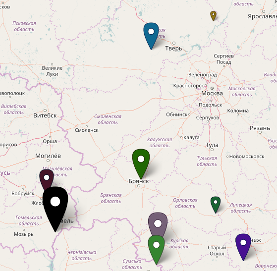

# MarkerMaker
Small service for outlining map pins.

Especially useful for creating custom [Leaflet](http://leafletjs.com/) markers.

Demo: https://mmaltsev.github.io/MarkerMaker/

## Setup
```html
<script src="https://cdn.rawgit.com/mmaltsev/MarkerMaker/master/main.js"></script>
```

## Usage
```javascript
let iconUrl = pinOutline(color, width, height)
```
For a better understanding just go through the [demo code](index.html).

## Example


## License.
MIT License. Copyright (c) 2017 Maxim Maltsev.
